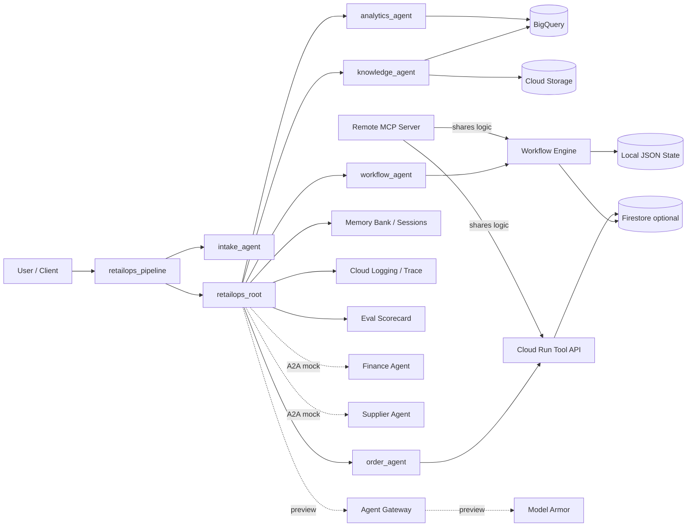

# Next '26 Agent Platform Showcase

A complete reference implementation for **Gemini Enterprise Agent Platform** with a realistic multi-agent retail operations workflow, now expanded with durable human-in-the-loop workflows, A2A federation, remote MCP, and release-grade evaluation.

This repo exercises **Google Cloud Next '26** capabilities while being explicit about what is
**runnable-now**, what is a **preview-scaffold**, and what is an **optional-integration**.

## What this project demonstrates

### runnable-now

- **ADK multi-agent** architecture (intake → root → knowledge / analytics / order / workflow)
- **Durable replenishment workflows** with pause/resume, approval gates, escalation, and audit replay
- **A2A federation** — local mock Finance + Supplier agents with a clean routing layer
- **Remote MCP server** — same tools over HTTP, deployable to Cloud Run
- **Agent card** generation (`docs/examples/retailops-agent-card.json`)
- **Local governance simulation** — prompt injection + exfiltration + unsafe-tool detection
- **Release scorecard** — workflow, A2A, and policy eval suites with golden cases
- **Correlation IDs** propagated across all service boundaries
- BigQuery analytics, Cloud Storage grounding, Cloud Run REST tool API
- stdio MCP server for Cursor, Agent Runtime deployment, Terraform infra

### preview-scaffold

- **Gemini Enterprise A2A registration** (`ENABLE_A2A_EXPERIMENTAL=true`)
- **Firestore workflow state store** (`WORKFLOW_STATE_BACKEND=firestore`)
- **Agent Gateway** policy enforcement (`governance/agent-gateway.example.yaml`)
- **Semantic Governance** (`governance/semantic-governance.example.yaml`)

### optional-integration

- **Google Workspace connectors** — Drive, Gmail, Calendar (`ENABLE_WORKSPACE_CONNECTORS=true`)
- **Model Armor** (`governance/model-armor.example.yaml`)
- **Firestore** order persistence (tool API)

## Architecture



## Feature Matrix

| Feature | Status | Local | Cloud | Notes |
|---|---|---|---|---|
| ADK multi-agent orchestration | runnable-now | ✅ | ✅ | 5 agents |
| Durable replenishment workflows | runnable-now | ✅ | ✅ | pause/resume/escalate |
| Approval threshold policy | runnable-now | ✅ | ✅ | risk-tolerance adjustable |
| Workflow audit log + replay | runnable-now | ✅ | ✅ | append-only JSONL |
| Cloud Run workflow endpoints | runnable-now | ✅ | ✅ | 6 new REST endpoints |
| A2A mock federation | runnable-now | ✅ | ✅ | Finance + Supplier agents |
| Agent card generation | runnable-now | ✅ | ✅ | `make generate-agent-card` |
| Remote MCP server | runnable-now | ✅ | ✅ | HTTP, Cloud Run-deployable |
| stdio MCP server (Cursor) | runnable-now | ✅ | — | `make mcp-retailops` |
| Local governance simulation | runnable-now | ✅ | — | NOT for production |
| Release scorecard | runnable-now | ✅ | ✅ | JSON artifact per run |
| Correlation IDs | runnable-now | ✅ | ✅ | X-Request-ID + traceparent |
| BigQuery analytics | runnable-now | — | ✅ | products + sales tables |
| Cloud Storage grounding | runnable-now | — | ✅ | `gs://` bucket |
| Agent Runtime deployment | runnable-now | — | ✅ | Vertex AI |
| Memory Bank | runnable-now | — | ✅/⚠️ | runtime config |
| Workspace connectors | optional-integration | ✅ mock | ✅ real | `ENABLE_WORKSPACE_CONNECTORS` |
| Firestore state store | optional-integration | — | ✅ | `WORKFLOW_STATE_BACKEND=firestore` |
| Gemini Enterprise A2A | preview-scaffold | mock | ⚠️ | `ENABLE_A2A_EXPERIMENTAL=true` |
| Agent Gateway | preview-scaffold | — | ⚠️ | example config only |
| Semantic Governance | preview-scaffold | — | ⚠️ | example config only |
| Model Armor | optional-integration | — | ⚠️ | GA in some regions |

## Quick Paths

### Local workflow demo

```bash
make install            # uv sync
cp .env.example .env    # no changes needed for local
make demo-workflow      # creates a workflow, shows pause/approve/complete
```

### Local A2A demo

```bash
make demo-a2a           # routes to Finance + Supplier mock agents
make generate-agent-card  # writes docs/examples/retailops-agent-card.json
```

### Local remote MCP demo

```bash
make run-remote-mcp-local       # starts server on :8090
make test-remote-mcp            # curl health + tool list
# In another terminal:
curl -X POST http://localhost:8090/mcp/tools/call \
  -H "Content-Type: application/json" \
  -d '{"name": "list_pending_approvals", "arguments": {}}'
```

### Local eval smoke suite

```bash
make eval-all           # workflow + A2A + policy evals → eval/results/
```

### Cloud deployment path

```bash
# 1. Provision infrastructure
cd infra/terraform && terraform apply -var="project_id=YOUR_PROJECT" && cd ../..
# 2. Seed data
make seed-data
# 3. Deploy REST tool API
make deploy-tool-api
# 4. Deploy remote MCP (optional)
make deploy-remote-mcp
# 5. Deploy agent runtime
make deploy-agent
# 6. Run full evaluation
make eval-agent
```

## Reality Check

| Category | Status |
|---|---|
| Multi-agent ADK app with workflows | **runnable-now** |
| Human-in-the-loop approval workflow | **runnable-now** |
| A2A federation (local mocks) | **runnable-now** |
| Remote MCP server (local + Cloud Run) | **runnable-now** |
| Local eval suite + scorecard | **runnable-now** |
| Workspace connectors (mock) | **runnable-now** |
| Local governance simulation | **runnable-now** (NOT for production) |
| Gemini Enterprise A2A registration | **preview-scaffold** |
| Agent Gateway enforcement | **preview-scaffold** |
| Semantic Governance enforcement | **preview-scaffold** |
| Workspace connectors (real API) | **optional-integration** |
| Firestore workflow persistence | **optional-integration** |
| Model Armor integration | **optional-integration** |

## Example use case

The demo agent acts as a **RetailOps Copilot**:

- answers questions about products and inventory
- summarizes sales trends
- creates replenishment orders
- requests approval for high-value orders
- stores long-lived user preferences and account context
- can be evaluated on tool use quality and final response quality

This gives you an opinionated but practical testbed for:

- developer-led ADK build flows
- production deployment on Agent Runtime
- tool calling into BigQuery / Cloud Run
- governance overlays as they become available in your project
- observability and evaluation loops

---

## 1. Repository layout

```text
.
├── app/
│   ├── agents/
│   │   └── retailops_agent.py           # Multi-agent ADK app (5 agents)
│   ├── a2a/                             # A2A federation (runnable-now + preview-scaffold)
│   │   ├── models.py
│   │   ├── agent_card.py
│   │   ├── provider.py
│   │   ├── mock_external_agents.py
│   │   └── clients/
│   │       ├── finance_agent_client.py
│   │       └── supplier_agent_client.py
│   ├── connectors/                      # Workspace connectors (optional-integration)
│   │   ├── base.py
│   │   ├── drive_connector.py
│   │   ├── gmail_connector.py
│   │   └── calendar_connector.py
│   ├── deploy/                          # Deployment entrypoints
│   ├── evals/                           # Local eval suites (runnable-now)
│   │   ├── workflow_eval.py
│   │   ├── a2a_eval.py
│   │   └── policy_eval.py
│   ├── governance/                      # Local policy simulation (dev/test only)
│   │   └── local_guardrails.py
│   ├── observability/                   # Tracing + scorecard
│   │   ├── correlation.py
│   │   ├── trace_helpers.py
│   │   └── release_scorecard.py
│   ├── tools/
│   │   ├── analytics_tools.py
│   │   ├── commerce_tools.py
│   │   ├── mcp_stdio_retailops.py       # stdio MCP for Cursor
│   │   ├── mcp_remote_adapters.py       # Shared logic for all transports
│   │   ├── workflow_tools.py            # Agent-callable workflow tools
│   │   ├── config.py
│   │   ├── memory_helpers.py
│   │   └── storage_tools.py
│   └── workflows/                       # Durable workflow engine (runnable-now)
│       ├── state_models.py
│       ├── state_store.py
│       ├── audit_log.py
│       ├── approval_handlers.py
│       ├── resume_handlers.py
│       └── order_replenishment.py
├── cloudrun/
│   ├── tool_api/                        # REST tool API (purchase orders + workflows)
│   │   ├── Dockerfile
│   │   ├── main.py
│   │   └── requirements.txt
│   └── remote_mcp/                      # Remote MCP server (runnable-now)
│       ├── Dockerfile
│       ├── main.py
│       └── requirements.txt
├── datasets/
├── docs/
│   ├── a2a-architecture.md
│   ├── evaluation-runbook.md
│   ├── governance-enforcement.md
│   ├── observability-runbook.md
│   ├── remote-mcp-runbook.md
│   ├── roadmap-next26.md
│   ├── workflow-state-model.md
│   ├── workspace-connectors.md
│   └── examples/
│       └── retailops-agent-card.json
├── eval/
│   ├── golden/                          # Golden eval datasets
│   │   ├── workflow_cases.csv
│   │   ├── a2a_cases.csv
│   │   └── policy_cases.csv
│   └── results/                         # Scorecard artifacts (git-ignored)
├── governance/                          # Preview config examples
├── infra/terraform/
├── scripts/
├── tests/
│   ├── a2a/
│   ├── governance/
│   ├── workflows/
│   └── ... (existing test modules)
├── .env.example
├── Makefile
└── pyproject.toml
```

---

## 2. Feature mapping to Next '26

See `docs/feature-mapping.md` for the detailed table. The short version:

| Next '26 capability                           | Status in this repo | Notes                                                 |
| --------------------------------------------- | ------------------: | ----------------------------------------------------- |
| Gemini Enterprise Agent Platform              |                  ✅ | ADK + Agent Runtime deployment                        |
| ADK graph / multi-agent patterns              |                  ✅ | Root orchestrator + specialists                       |
| Agent Identity                                |                  ✅ | Runtime deploy config                                 |
| Sessions                                      |                  ✅ | Used by runtime and local runner                      |
| Memory Bank                                   |               ✅/⚠️ | Helpers + runtime config; depends on project setup    |
| Agent Evaluation                              |                  ✅ | SDK evaluation script                                 |
| Agent Observability                           |                  ✅ | Telemetry env var + Cloud Logging / Trace integration |
| Agent Gateway                                 |                  ⚠️ | Example config only; private preview                  |
| Semantic Governance                           |                  ⚠️ | Example policy only; private preview                  |
| Model Armor with Gateway                      |                  ⚠️ | Example config only                                   |
| BigQuery / Agentic Data Cloud style analytics |                  ✅ | Product + sales tools                                 |
| Knowledge Catalog / Smart Storage             |                  ⚠️ | Integration notes and placeholders                    |
| Cloud Run integration                         |                  ✅ | Tool API and deploy script                            |
| Cloud Run remote MCP (managed / productized)  |                  ⚠️ | Rollout notes; local stdio MCP bridge ships in-repo   |
| Simulated sessions                            |                  ⚠️ | Console-first workflow today                          |

---

## 3. Prerequisites

- Python 3.11+
- `gcloud` CLI
- Terraform 1.7+
- A Google Cloud project with billing enabled
- Access to Gemini Enterprise Agent Platform / Vertex AI APIs in your region
- Recommended region: `us-central1`

Install core Python dependencies:

```bash
python -m venv .venv
source .venv/bin/activate
pip install -e .
```

Authenticate:

```bash
gcloud auth application-default login
gcloud config set project YOUR_PROJECT_ID
```

---

## 4. Bootstrap the project

Copy `.env.example` to `.env` and edit values:

```bash
cp .env.example .env
```

Provision infrastructure:

```bash
cd infra/terraform
terraform init
terraform apply -var="project_id=YOUR_PROJECT_ID"
cd ../..
```

Seed the demo warehouse:

```bash
make seed-data
```

Deploy the Cloud Run tool API:

```bash
make deploy-tool-api
```

### Tool API security (IAM + ID tokens)

The tool API is deployed **without** public (`allUsers`) access. Cloud Run requires a valid **OIDC ID token** whose audience is the service URL, and the token subject must have **`roles/run.invoker`** on the service.

1. **After first deploy**, grant invoker to every caller that needs the API:
   - **Agent Runtime** (Agent Identity): the Google-managed service account used by your deployed reasoning engine / agent engine.
   - **Local development** (stdio MCP, `commerce_tools`): your user or the principal behind Application Default Credentials (`gcloud auth application-default login`).

   ```bash
   MEMBER='user:you@example.com' bash scripts/grant_cloudrun_tool_api_invoker.sh
   # or
   MEMBER='serviceAccount:AGENT_ENGINE_IDENTITY@PROJECT_ID.iam.gserviceaccount.com' bash scripts/grant_cloudrun_tool_api_invoker.sh
   ```

2. **Client code** ([`app/tools/commerce_tools.py`](app/tools/commerce_tools.py)) sends `Authorization: Bearer <ID token>` automatically when `CLOUDRUN_TOOL_API_BASE_URL` is an `https://` URL (skipped for `http://localhost` / `127.0.0.1` or when `CLOUDRUN_TOOL_API_SKIP_ID_TOKEN=true`).

3. **Rollout order**: grant `run.invoker` to the agent identity **before** relying on tool calls from a locked-down service, or the runtime will receive HTTP 403 until IAM is updated.

See [Authenticating service-to-service](https://cloud.google.com/run/docs/authenticating/service-to-service) and [Authenticate to tools and resources](https://docs.cloud.google.com/agent-registry/authenticate-toolsets) for the broader Agent Registry / ADK patterns.

Run the agent locally:

```bash
make run-local
```

Deploy to Agent Runtime:

```bash
make deploy-agent
```

Run evaluation:

```bash
make eval-agent
```

Run judge calibration:

```bash
make eval-judge-calibration
```

Evaluation artifacts are written under `eval/results/`. See `docs/evaluation-runbook.md` for gate thresholds, metrics, and CI behavior.

---

## 5. Dependency ownership and deploy preflight

To keep runtime dependencies aligned across deploy entrypoints, use this source-of-truth flow:

- update dependency versions in `pyproject.toml`
- regenerate derived requirement files with Make targets
- run drift checks before deployment

Generate requirements files:

```bash
make deps-export-agent-runtime
make deps-export-tool-api
```

These Make targets delegate to Python entrypoints for maintainability:

- `app.deploy.export_requirements` handles deterministic requirements file generation
- `app.deploy.preflight` handles deploy invariant checks

You can run the entrypoints directly when debugging:

```bash
uv run python -m app.deploy.export_requirements --target agent-runtime
uv run python -m app.deploy.export_requirements --target tool-api
uv run python -m app.deploy.preflight
```

Verify there is no drift from generated files:

```bash
make deps-verify-drift
```

Run deploy preflight checks before remote deployment:

```bash
make deploy-agent-preflight
```

Then deploy:

```bash
make deploy-agent
```

## 5.1 Quality gate for agent code

Run the strict Python quality harness locally before opening a PR:

```bash
make quality-gate
```

For optional, slower security checks:

```bash
make quality-gate-optional
```

Policy details and suppression guidance live in `docs/strict-agent-harness.md`.

---

## 5.2 Agent observability checklist

This repo turns on **Agent Runtime telemetry** at deploy time (`GOOGLE_CLOUD_AGENT_ENGINE_ENABLE_TELEMETRY=true` in [`app/deploy/deploy_agent_runtime.py`](app/deploy/deploy_agent_runtime.py)). Use the following to finish **platform-native** observability in Google Cloud.

### APIs (Terraform)

[`infra/terraform/main.tf`](infra/terraform/main.tf) enables, among others:

- `telemetry.googleapis.com` (OTLP / telemetry ingestion)
- `logging.googleapis.com`, `cloudtrace.googleapis.com`, `monitoring.googleapis.com`
- `apphub.googleapis.com`, `observability.googleapis.com`, `apptopology.googleapis.com` (for **Topology** and related console flows)

Apply with your usual Terraform workflow, then confirm services are enabled in **APIs and services**.

### Environment variables

| Variable                                     | Purpose                                                                                                                                                                                                                                                                                                                     |
| -------------------------------------------- | --------------------------------------------------------------------------------------------------------------------------------------------------------------------------------------------------------------------------------------------------------------------------------------------------------------------------- |
| `GOOGLE_CLOUD_AGENT_ENGINE_ENABLE_TELEMETRY` | Agent traces and logs (metadata); set automatically on deploy.                                                                                                                                                                                                                                                              |
| `CAPTURE_GENAI_MESSAGE_CONTENT`              | When `true` in the environment used for deploy, sets `OTEL_INSTRUMENTATION_GENAI_CAPTURE_MESSAGE_CONTENT` so **prompts and completions** can be logged. **Default off**; enable only where compliance approves. See [Set up tracing](https://docs.cloud.google.com/gemini-enterprise-agent-platform/scale/runtime/tracing). |

Copy [`.env.example`](.env.example) and set `CAPTURE_GENAI_MESSAGE_CONTENT=true` only for non-production if you need full message capture.

### IAM for operators

Grant least privilege to people who need the console (see [View agent traces](https://docs.cloud.google.com/gemini-enterprise-agent-platform/optimize/observability/traces) and [Topology](https://docs.cloud.google.com/gemini-enterprise-agent-platform/optimize/observability/topology)):

- `roles/cloudtrace.user` — inspect traces
- `roles/logging.viewer` — read logs correlated from trace UI when message capture is enabled
- `roles/apptopology.viewer` — topology graphs (if using topology)
- Agent Registry viewer role as in current docs (for example `roles/agentregistry.viewer` where available)

Prefer a **narrow** group for log access that may include prompts, and a **broader** group for trace metadata only.

### Where to look in the console

1. **Agent Registry** → your agent → **Traces**: Session, Trace, and Span views for multi-turn runs and tool calls ([View agent traces](https://docs.cloud.google.com/gemini-enterprise-agent-platform/optimize/observability/traces)).
2. **Topology** (project or agent tab): dependency graph from aggregated trace data; components must meet platform rules (functional types, registration). See [View agent relationships](https://docs.cloud.google.com/gemini-enterprise-agent-platform/optimize/observability/topology).

### Correlation: agent → Cloud Run tool API

Outbound tool calls from [`app/tools/commerce_tools.py`](app/tools/commerce_tools.py) send **`X-Request-ID`** and **W3C `traceparent`** (when OpenTelemetry context is active). The Cloud Run service in [`cloudrun/tool_api/main.py`](cloudrun/tool_api/main.py) echoes **`X-Request-ID`**, logs it with the path, and logs **`traceparent`** when present so you can align Agent Runtime traces with tool API **Cloud Logging** entries.

---

## 6. Local test prompts

Try:

- `Which backpacks are trending this month and what is current stock?`
- `Create a replenishment order for the top-selling trail backpack.`
- `Create a replenishment order for 600 alpine shells and tell me if approval is needed.`
- `Remember that I prefer conservative reorder recommendations.`
- `What did I tell you about my reorder preference last time?`

---

## 7. How preview features fit in

### Agent Gateway

Use the examples under `governance/` once your project has access. The intended path is:

1. deploy the agent on Agent Runtime
2. register / route traffic via Agent Gateway
3. attach Model Armor and semantic governance rules
4. inspect network-layer telemetry in Agent Observability

### Knowledge Catalog / Smart Storage

This repo currently implements the closest public pattern:

- grounded docs in Cloud Storage
- structured facts in BigQuery
- metadata-friendly data layout
- optional hooks for Dataplex / Knowledge Catalog adoption later

### Cloud Run remote MCP

The tool API in `cloudrun/tool_api` is intentionally simple REST today. Once Cloud Run remote MCP is available in your environment, you can expose the same business capabilities through MCP with minimal business-logic changes.

### Local stdio MCP (Cursor)

Use the in-repo MCP server to call the tool API from Cursor (or any MCP host that spawns a stdio server).

1. Deploy or run the tool API and set `CLOUDRUN_TOOL_API_BASE_URL` (see `.env.example`). If the service is already on Cloud Run, generate a ready-to-merge fragment (fills `cwd` and the HTTPS URL from `gcloud`):

   ```bash
   bash scripts/get_deployed_mcp_config.sh
   ```

   Machine-readable JSON only (for piping or saving):

   ```bash
   bash scripts/get_deployed_mcp_config.sh --json
   ```

   Shortcut: `make describe-mcp-config` (same as the first command, via `uv run bash`).

2. Add an MCP server entry. **Use `uv run`** so the project virtualenv (with the editable `app` package) is used; plain `python -m app.tools...` will fail with `No module named 'app'`.

Preferred (`command` is `uv`, `cwd` is your clone):

```json
{
  "mcpServers": {
    "retailops-tool-api": {
      "command": "uv",
      "args": ["run", "python", "-m", "app.tools.mcp_stdio_retailops"],
      "cwd": "/absolute/path/to/next26-agent-platform-showcase",
      "env": {
        "CLOUDRUN_TOOL_API_BASE_URL": "https://YOUR-CLOUD-RUN-URL"
      }
    }
  }
}
```

Alternative (avoids relying on `cwd`; still needs `uv` on `PATH`):

```json
{
  "mcpServers": {
    "retailops-tool-api": {
      "command": "bash",
      "args": [
        "/absolute/path/to/next26-agent-platform-showcase/scripts/run_mcp_stdio_retailops.sh"
      ],
      "env": {
        "CLOUDRUN_TOOL_API_BASE_URL": "https://YOUR-CLOUD-RUN-URL"
      }
    }
  }
}
```

Run once from the clone: `uv sync` (installs deps including `mcp` and the local package).

**Troubleshooting:** If MCP logs show `ModuleNotFoundError: No module named 'app'`, the subprocess is almost certainly **not** using `uv run` from the repo root (for example `command` points at a bare `python3.12`). Fix the JSON as above, or use `scripts/run_mcp_stdio_retailops.sh`. Verify from the clone:

```bash
uv run python -c "import app.tools.mcp_stdio_retailops"
```

3. From the repo root, a manual smoke check is:

```bash
uv run python -m app.tools.mcp_stdio_retailops
```

The process waits on stdio for the host; stop it from the IDE or with Ctrl+C. Equivalent shortcut: `make mcp-retailops`.

Tools exposed: `create_purchase_order`, `submit_approval_request`, `get_order_status`, and `check_tool_api_health` (`GET /healthz`). Implementation details: [`app/tools/mcp_stdio_retailops.py`](app/tools/mcp_stdio_retailops.py).

---

## 8. Recommended extensions

- swap synthetic CSVs for ERP extracts landing in Cloud Storage
- add vector search for product manuals / field notes
- connect approval workflows to Gmail / Chat / Workspace
- replace the demo order API with SAP / Oracle / ServiceNow connectors
- add canary eval gates in CI/CD
- expose the order agent through A2A for cross-agent reuse

---

## 9. Cleanup

```bash
terraform -chdir=infra/terraform destroy -var="project_id=YOUR_PROJECT_ID"
```

Delete deployed reasoning engines and Cloud Run services if you created them outside Terraform.

---

## 10. Troubleshooting

### Auth failures

**`403 Forbidden` on Cloud Run tool API**

Grant `roles/run.invoker` to your identity:
```bash
MEMBER='user:you@example.com' bash scripts/grant_cloudrun_tool_api_invoker.sh
```

**`ModuleNotFoundError: No module named 'app'` in MCP server**

Run from repo root with `uv run`:
```bash
cd /path/to/next26-agent-platform-showcase
make mcp-retailops
```

### Workflow persistence issues

**Workflow not found after restart**

State is persisted in `WORKFLOW_STATE_DIR` (default: `.local/state/`). Check:
```bash
ls .local/state/
cat .local/state/<workflow_id>.json | python -m json.tool
```

**Corrupted state file**

The engine returns `None` for corrupted files. Check the audit log instead:
```bash
cat .local/state/audit/<workflow_id>.jsonl
```

### Missing preview access

**`ENABLE_A2A_EXPERIMENTAL=true` but A2A registration fails**

A2A registration requires preview program access. Until then, use `A2A_USE_MOCKS=true`
(the default). See `docs/a2a-architecture.md`.

**Agent Gateway configuration has no effect**

Agent Gateway is a preview feature. The config examples in `governance/` are
scaffolding only. Contact your Google Cloud representative.

### MCP transport confusion

**When should I use stdio vs remote MCP?**

- **stdio** (`mcp_stdio_retailops.py`): Cursor/Claude Desktop on your laptop, single user
- **remote MCP** (`cloudrun/remote_mcp/main.py`): team-shared server, remote clients, Cloud Run deployment

Both use the same business logic via `mcp_remote_adapters.py`.

See `docs/remote-mcp-runbook.md` for the full comparison.

### Eval failures

**`Workflow golden CSV not found`**

Run from the repo root:
```bash
cd /path/to/next26-agent-platform-showcase
make eval-workflow
```

**`all policy cases skip`**

The governance module must be importable. Verify:
```bash
uv run python -c "from app.governance.local_guardrails import is_content_blocked; print('ok')"
```

**Scorecard shows regression**

Compare with the prior run:
```bash
ls eval/results/      # find prior scorecard
cat eval/results/scorecard_<timestamp>.json | python -m json.tool
```

---

## 11. Docs reference

| Doc | Description |
|---|---|
| `docs/workflow-state-model.md` | Workflow state machine, models, and API |
| `docs/a2a-architecture.md` | A2A federation design and preview path |
| `docs/remote-mcp-runbook.md` | Remote MCP server setup and auth matrix |
| `docs/evaluation-runbook.md` | All eval suites and scorecard system |
| `docs/observability-runbook.md` | Correlation IDs, tracing, scorecard |
| `docs/governance-enforcement.md` | Local guardrails → platform feature mapping |
| `docs/workspace-connectors.md` | Workspace connector setup |
| `docs/roadmap-next26.md` | Full feature status and architectural narrative |

---

## 12. Reality check

This repo is deliberately split between:

- **runnable-now** — works with `make install` and no cloud credentials
- **preview-scaffold** — clean adapter boundaries for features that require preview access
- **optional-integration** — documented, feature-flagged, rollback-safe

Every feature is labeled. No capability is silently faked.
